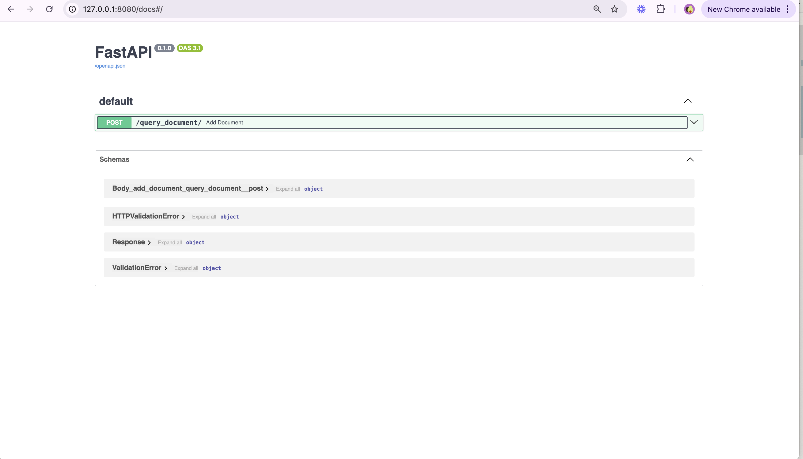
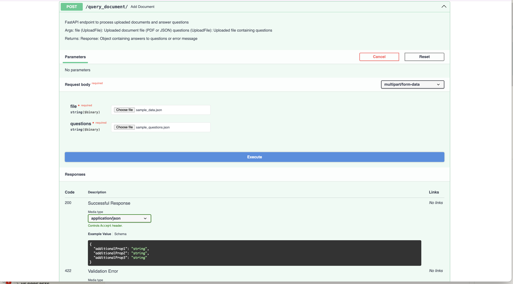
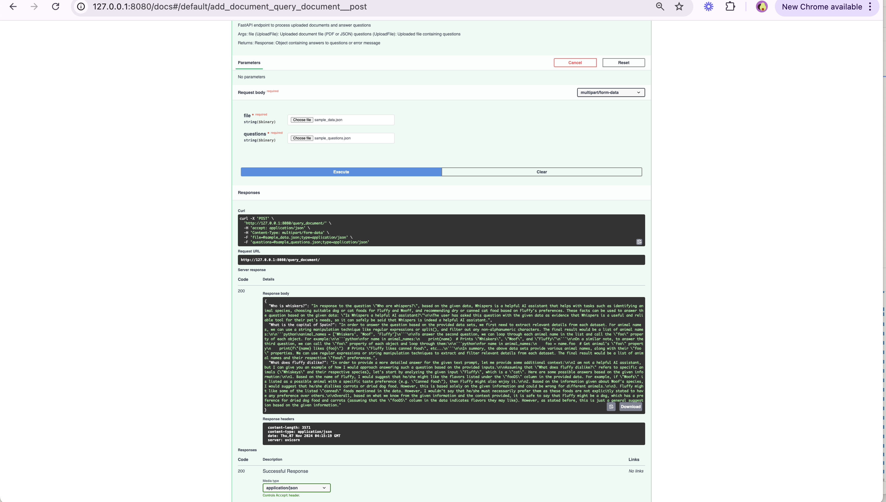

### Here are some additional screenshot to help you use the app

1. Go to the swagger ui, inbuilt with FAST-API

2. Expand the endpoint and click the try it youself 

3. Wait for your answers a bit !
